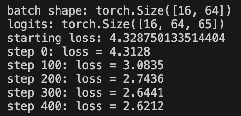

# Sparse Attention in PyTorch

This project is the implementation of sparse attention in PyTorch. I started with standard scaled dot-product attention, then built sliding window attention and a BigBird-style attention to understand how sparse attention works beyond the usual Transformer implementation.

## What I implemented

* Dense scaled dot-product attention
* Sliding window attention
* BigBird-style attention (local + global + random connections)
* Softmax with NaN handling
* A 2-layer character-level GPT trained on TinyShakespeare

## Project structure

postman-sparse-attention/

* `attention/` – dense, sliding window and BigBird implementations
* `training/` – TinyShakespeare training code
* `benchmark/` – timing script and graph
* `tests/` – basic correctness tests

## How to run

Create a virtual environment and install the requirements.

```bash
python3 -m venv venv
source venv/bin/activate
pip install -r requirements.txt
```

### Run the tests

```bash
python3 -m pytest tests/test_attention.py -v
```

### Run the benchmark

```bash
python3 benchmark/benchmark.py
```

This also saves a graph as `benchmark/timing.png`.(later renamed to benchmark_result.png)

### Train TinyGPT

```bash
python3 training/train.py
```

The script trains a small character-level GPT and generates sample Shakespeare-style text after training.

## Benchmark

The benchmark was run on my CPU.

| Sequence Length |    Dense | Sliding Window |
| --------------: | -------: | -------------: |
|             512 | 0.0026 s |       0.0522 s |
|            1024 | 0.0053 s |       0.0374 s |
|            2048 | 0.0109 s |       0.1066 s |

The sliding-window implementation computes fewer attention scores, but it still uses a Python loop over tokens. Because PyTorch's dense matrix multiplication is heavily optimized, the sparse version ends up slower on CPU even though it performs less theoretical work.

## TinyGPT results

I trained a small 2-layer character-level GPT on TinyShakespeare.

Training loss:



The generated text is still imperfect after only a few hundred steps, but it starts producing Shakespeare-like formatting, punctuation and names.

Example:

(This is the obtained response)

> "Kerinerkthearino thantthe ntr, b, tbtol onfom
!
qme supuse d imora Ikheou'fo His tde; hC.
G:
REGRQAf harastser mlof,
Ighohe heeveqidAVhalouson'rs o!ctaineYeVine, f
I. heesthllede fr n:
P, e az t p?
He man, at WhitoLil, I oulifan co me ame yonervele ve
Aust s sh. tis itoorpo olap tosthe, wit tawit we..."


